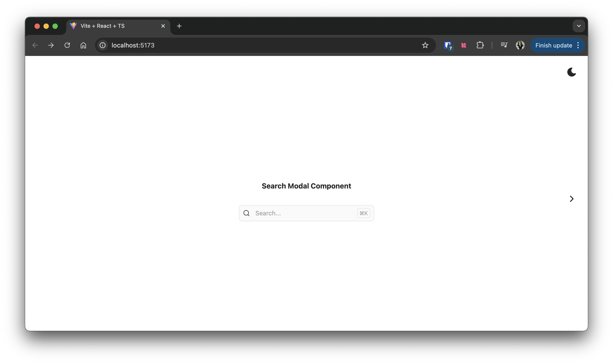
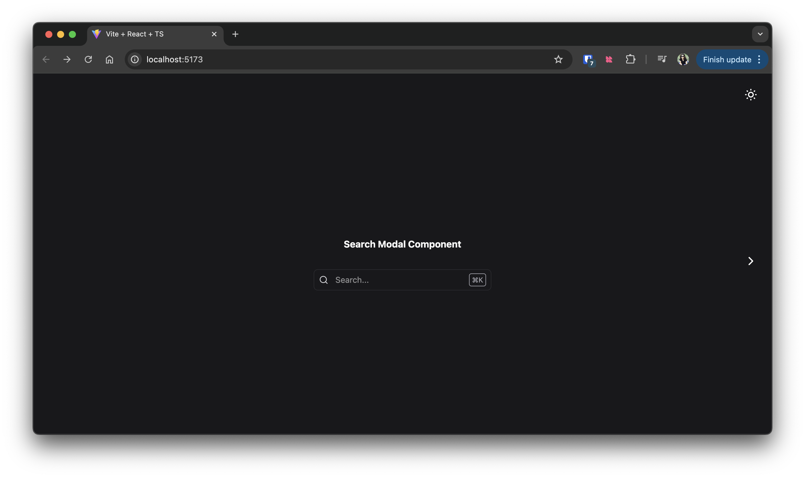
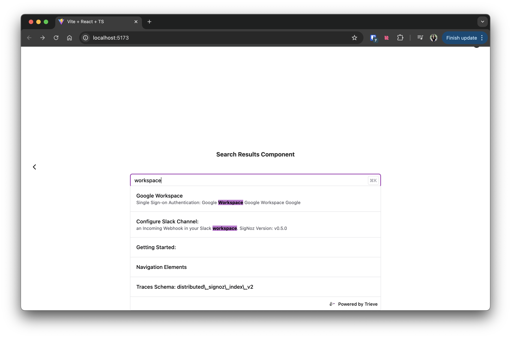
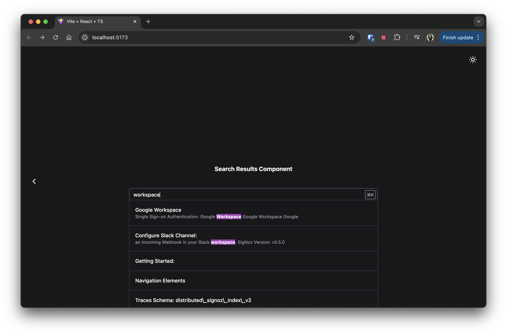

## Trieve Search Component

The easiest way to get up and running in your app using trieve search.

## How to use

Install using your favorite package manager:

```
yarn add trieve-search-component
# or
npm install trieve-search-component
# or
pnpm install trieve-search-component
```

After installing the first step is to instantiate a new `TrieveSDK` like so:

```ts
import { TrieveSDK } from "trieve-ts-sdk";

export const trieve = new TrieveSDK({
  apiKey: "<your-api-key>",
  datasetId: "<dataset-to-use>",
});
```

And then you can use any of the two components in your React application or as web component:

### Search Modal

<details>
<summary>Screenshots</summary>





</details>

#### Usage in React:

```jsx
<TrieveModalSearch trieve={trieve} />
```

#### Usage in Web Components:

```js
initModalSearch({
  trieve: new TrieveSDK({
    // your options
  })
})


<trieve-modal-search />

```

If you are using it in JSX environment you will need to add the `trieve-modal-search` to the JSX attributes, for solid that would be:

```typescript
declare module "solid-js" {
  namespace JSX {
    interface IntrinsicElements {
      "trieve-modal-search": {};
      "trieve-search": {};
    }
  }
}
```

#### Props

| Name                       | Type                                                                                                                                                                 | Default                                                                                                                                                                                                                                                                                                                                                                                                                                                                                                                                                                   |
| -------------------------- | -------------------------------------------------------------------------------------------------------------------------------------------------------------------- | ------------------------------------------------------------------------------------------------------------------------------------------------------------------------------------------------------------------------------------------------------------------------------------------------------------------------------------------------------------------------------------------------------------------------------------------------------------------------------------------------------------------------------------------------------------------------- |
| datasetId                  | string                                                                                                                                                               | ''                                                                                                                                                                                                                                                                                                                                                                                                                                                                                                                                                                        |
| apiKey                     | string                                                                                                                                                               | ''                                                                                                                                                                                                                                                                                                                                                                                                                                                                                                                                                                        |
| baseUrl                    | string                                                                                                                                                               | "https://api.trieve.ai"                                                                                                                                                                                                                                                                                                                                                                                                                                                                                                                                                   |
| type                       | "docs"                                                                                                                                                               | "ecommerce"                                                                                                                                                                                                                                                                                                                                                                                                                                                                                                                                                               |
| useGroupSearch             | boolean                                                                                                                                                              | false                                                                                                                                                                                                                                                                                                                                                                                                                                                                                                                                                                     |
| chat                       | boolean                                                                                                                                                              | true                                                                                                                                                                                                                                                                                                                                                                                                                                                                                                                                                                      |
| analytics                  | boolean                                                                                                                                                              | true                                                                                                                                                                                                                                                                                                                                                                                                                                                                                                                                                                      |
| placeholder                | string                                                                                                                                                               | "Search..."                                                                                                                                                                                                                                                                                                                                                                                                                                                                                                                                                               |
| onResultClick              | () => void                                                                                                                                                           | () => {}                                                                                                                                                                                                                                                                                                                                                                                                                                                                                                                                                                  |
| theme                      | "light" or "dark"                                                                                                                                                    | "light"                                                                                                                                                                                                                                                                                                                                                                                                                                                                                                                                                                   |
| searchOptions              | [AutocompleteReqPayload](https://ts-sdk.trieve.ai/types/types_gen.AutocompleteReqPayload.html)                                                                       | `{ search_type: "fulltext" }`                                                                                                                                                                                                                                                                                                                                                                                                                                                                                                                                             |
| openKeyCombination         | { key?: string; label?: string; ctrl?: boolean }[]                                                                                                                   | [{ ctrl: true }, { key: "k", label: "K" }]                                                                                                                                                                                                                                                                                                                                                                                                                                                                                                                                |
| tags                       | { tag: string; label?: string; selected? boolean; iconClassName?: string }[]                                                                                         | [{tag: "docs", label: "dev docs", iconClassName: "fa-solid fa-info"}]                                                                                                                                                                                                                                                                                                                                                                                                                                                                                                     |
| relevanceToolCallOptions   | { userMessageTextPrefix?: string; includeImages?: boolean; toolDescription: string; highDescription?: string; mediumDescription?: string; lowDescription?: string; } | `{ userMessageTextPrefix: "Be extra picky and detailed...", includeImages: false, toolDescription: "Mark the relevance...", highDescription: "Highly relevant and very good fit for the given query taking all details of both the query and the product into account", mediumDescription: "Somewhat relevant and a decent or okay fit for the given query taking all details of both the query and the product into account", lowDescription: "Not relevant and not a good fit for the given query taking all details of both the query and the product into account" }` |
| inline                     | boolean                                                                                                                                                              | true                                                                                                                                                                                                                                                                                                                                                                                                                                                                                                                                                                      |
| inlineHeader               | string                                                                                                                                                               | ""                                                                                                                                                                                                                                                                                                                                                                                                                                                                                                                                                                        |
| initialAiMessage           | string                                                                                                                                                               | ""                                                                                                                                                                                                                                                                                                                                                                                                                                                                                                                                                                        |
| ButtonEl                   | JSX.ElementType                                                                                                                                                      | null                                                                                                                                                                                                                                                                                                                                                                                                                                                                                                                                                                      |
| suggestedQueries           | boolean                                                                                                                                                              | true                                                                                                                                                                                                                                                                                                                                                                                                                                                                                                                                                                      |
| defaultSearchQueries       | string[]                                                                                                                                                             | []                                                                                                                                                                                                                                                                                                                                                                                                                                                                                                                                                                        |
| defaultAiQuestions         | string[]                                                                                                                                                             | []                                                                                                                                                                                                                                                                                                                                                                                                                                                                                                                                                                        |
| brandLogoImgSrcUrl         | string                                                                                                                                                               | null                                                                                                                                                                                                                                                                                                                                                                                                                                                                                                                                                                      |
| brandName                  | string                                                                                                                                                               | null                                                                                                                                                                                                                                                                                                                                                                                                                                                                                                                                                                      |
| brandColor                 | string                                                                                                                                                               | #CB53EB                                                                                                                                                                                                                                                                                                                                                                                                                                                                                                                                                                   |
| brandFontFamily            | string                                                                                                                                                               | Maven Pro                                                                                                                                                                                                                                                                                                                                                                                                                                                                                                                                                                 |
| problemLink                | string (example: "mailto:help@trieve.ai?subject=")                                                                                                                   | null                                                                                                                                                                                                                                                                                                                                                                                                                                                                                                                                                                      |
| responsive                 | boolean                                                                                                                                                              | false                                                                                                                                                                                                                                                                                                                                                                                                                                                                                                                                                                     |
| floatingButtonPosition     | "top-left", "top-right", "bottom-left", or "bottom-right"                                                                                                            | "bottom-right"                                                                                                                                                                                                                                                                                                                                                                                                                                                                                                                                                            |
| showFloatingButton         | boolean                                                                                                                                                              | false                                                                                                                                                                                                                                                                                                                                                                                                                                                                                                                                                                     |
| floatingSearchIconPosition | "left" or "right"                                                                                                                                                    | "right"                                                                                                                                                                                                                                                                                                                                                                                                                                                                                                                                                                   |
| showFloatingSearchIcon     | boolean                                                                                                                                                              | false                                                                                                                                                                                                                                                                                                                                                                                                                                                                                                                                                                     |
| showFloatingInput          | boolean                                                                                                                                                              | false                                                                                                                                                                                                                                                                                                                                                                                                                                                                                                                                                                     |
| buttonTriggers             | [{ selector: <"query-selector">, mode: "chat", removeListeners: true}]                                                                                               |                                                                                                                                                                                                                                                                                                                                                                                                                                                                                                                                                                           |
| hideOpenButton             | boolean                                                                                                                                                              | false                                                                                                                                                                                                                                                                                                                                                                                                                                                                                                                                                                     |
| showResultHighlights       | boolean                                                                                                                                                              | true                                                                                                                                                                                                                                                                                                                                                                                                                                                                                                                                                                      |
| initialAiMessage           | string (example: "<p>Hi! How can I help</p>")                                                                                                                        | null                                                                                                                                                                                                                                                                                                                                                                                                                                                                                                                                                                      |
| ignoreEventListeners       | boolean                                                                                                                                                              | false                                                                                                                                                                                                                                                                                                                                                                                                                                                                                                                                                                     |
| hideOverlay                | boolean                                                                                                                                                              | false                                                                                                                                                                                                                                                                                                                                                                                                                                                                                                                                                                     |
| overrideFetch              | boolean                                                                                                                                                              | false                                                                                                                                                                                                                                                                                                                                                                                                                                                                                                                                                                     |
| imageStarterText           | string                                                                                                                                                               | "Drag and drop an image here or click to upload"                                                                                                                                                                                                                                                                                                                                                                                                                                                                                                                          |
| notFilterToolCallOptions   | {userMessageTextPrefix?: string; toolDescription?: string}                                                                                                           | `{ userMessageTextPrefix: "Here is the user query:", toolDescription: "Set to true if the query is not interested in the products they were shown previously or would like to see something different. Ensure that this is only set to true when the user wants to see something different from the previously returned results or is not interested in those previously returned results." }`                                                                                                                                                                            |

### Search Results

<details>
<summary>Screenshots</summary>




</details>

#### Usage in React:

```jsx
<TrieveSearch
  apiKey="<your trieve apiKey>"
  datasetId="<your trieve datasetId"
/>
```

#### Usage in Web Components:

```html
<trieve-search
  apiKey="<your trieve apiKey>"
  datasetId="<your trieve datasetId"
/>
```

#### Usage with Vanilla JS

```javascript
import "trieve-search-component/styles";
import { renderToDiv } from 'trieve-search-component/vanilla';

const root = document.getElementById('root');
renderToDiv(root, {
  apiKey: "<Your Trieve Api Key>"
  datasetId: "<Your Trieve Dataset Id>"
   // ... other props
})
```

## License

MIT

## Development Guide

### Deploying to view search playground UI

The `example/` folder shows the example application for what rendering this would look like

Run the example, search-component, css, javascript and watcher for demos page

```sh
$clients/search-component yarn all
```

or to run each individually

Start the listener to update the search-component's css and javascript

```sh
$clients/search-component yarn
$clients/search-component yarn dev
```

Run the example application

```sh
$clients/search-component cd example/
$clients/search-component yarn
$clients/search-component yarn dev
```

### Viewing it on demos page

```sh
cd clients/search-component/
yarn all
```

Set environment variable in `server/.env`

```sh
SEARCH_COMPONENT_URL="http://localhost:8000"
```
